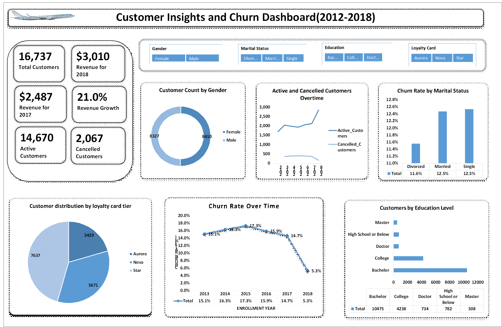

# Airline Excel Dashboard

This dashboard presents key flight performance insights using interactive charts in Microsoft Excel. It tracks passenger counts, cancellations, delays, and other critical metrics to support data-driven decisions in the aviation sector.

## Dashboard Preview

## Project Details
- *Tool Used*: Microsoft Excel
- *Techniques*: Charts, Slicers, PivotTables
- *Focus Areas*:
  - Flight performance metrics
  - Delay and cancellation analysis
  - Trend monitoring over time

## Insights Gained
- Top causes of delays
- Airlines with highest passenger traffic
- Trends in cancellation rates

## Skills Demonstrated
- Data Cleaning
- Data Visualization
- Dashboard Design

---

*Built with ❤ by Mariam Anuoluwapo*
